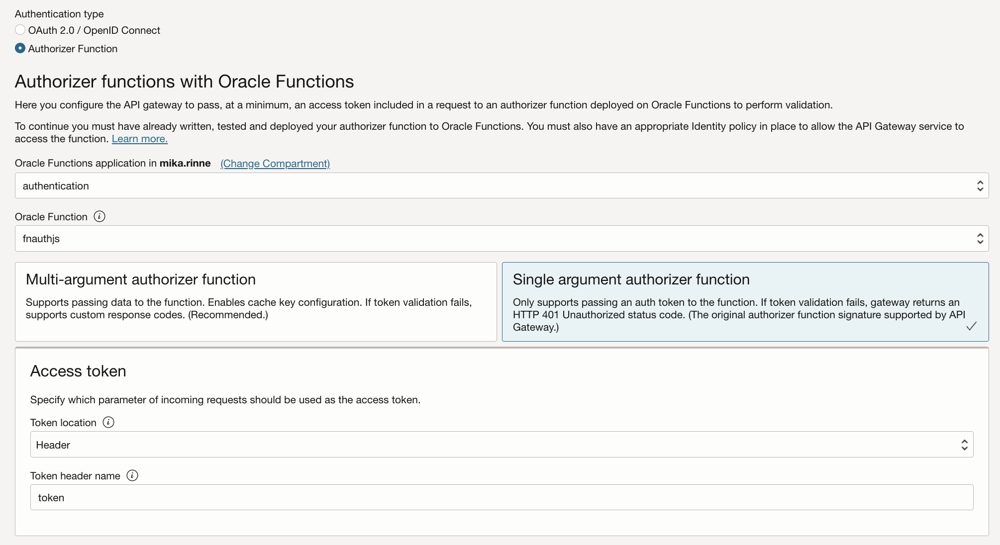
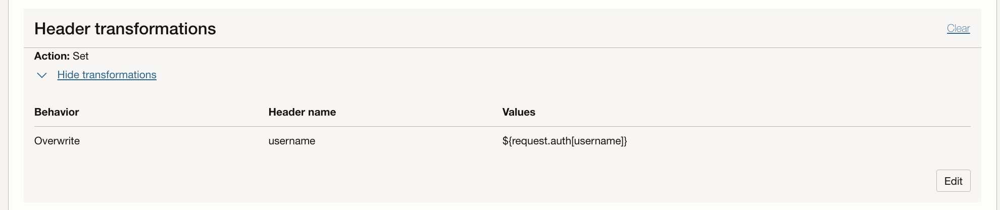

# API Gateway authorizer function context var example

## Build and deploy the functions

### Authorizer function fnauthjs
<pre>
const fdk=require('@fnproject/fdk');

fdk.handle(function(input){
  let json = "";

  if(input.token) {
      json = {
        "active": true,
        "principal": "myprincipal",
        "scope": ["fnsimplejs"],
        "clientId": "clientIdFromHeader",
        "expiresAt": "2023-12-31T00:00:00+00:00",
        "context": {
            "username": input.token
        }
      }
  } else {
      json = {
        "active": false,
        "expiresAt": "2023-12-31T00:00:00+00:00",
        "wwwAuthenticate": "Bearer realm=\"www.com\""
      }
  }
  return json;
})
</pre>

The authorizer function will pass on the <code>username</code> in <code>auth context</code> as a custom variable. The value for it is set from REST call input as <code>token</code> on the <a href="https://github.com/mikarinneoracle/js-authorizer-fn-example/blob/master/fnauthjs/func.js#L14">line 14 </a> i.e.
<pre>
curl -H "token: test-token" https://drp....56kvgu.apigateway.eu-amsterdam-1.oci.customer-oci.com/
</pre>
Hence the auth context var <code>username</code> gets the value <code>test-token</code>

### Backend / secondary function fnsimplejs
<pre>
const fdk=require('@fnproject/fdk');

fdk.handle(function(input, ctx){
  return ctx.headers['Fn-Http-H-Username'];
})    
</pre>

The secondary / backend function will get the authorizer passed variable <code>username</code>
as a transformed header variable <code>Fn-Http-H-Username</code> and will print it out as the
function REST call result on the <a href="https://github.com/mikarinneoracle/js-authorizer-fn-example/blob/master/fnsimplejs/func.js#L4">line 4</a> i.e.

<pre>
curl -H "token: test-token"  https://drp....56kvgu.apigateway.eu-amsterdam-1.oci.customer-oci.com/
["test-token"]
</pre>

## Create the API Gateway based on the functions and configure as follows

### Authorizer function fnauthjs

    
Use these settings for the <b><i>Single argument authorizer function</i></b>:

Token location: <b>Header</b>
 
Token header name: <b>token</b>
 
### Backend / secondary function fnsimplejs

    
### <i>auth context</i> variable <i>username</i> transformation in <i>Route Request Policies</i>

Use these settings for the <b><i>Header transformations</i></b>:

Behavior: <b>Overwrite</b>
 
Header name: <b>username</b>
 
Values: <b>${request.auth[username]}</b>

## Authorization error 401 Unauthorized

If no <code>token</code> is given in the API Gateway REST call the function will the secondary/backend function will not be called and will return <b>401 Unauthorized</b> error instead e.g. 
<pre>
curl https://drp....56kvgu.apigateway.eu-amsterdam-1.oci.customer-oci.com/
{"code":401,"message":"Unauthorized"}
</pre>

