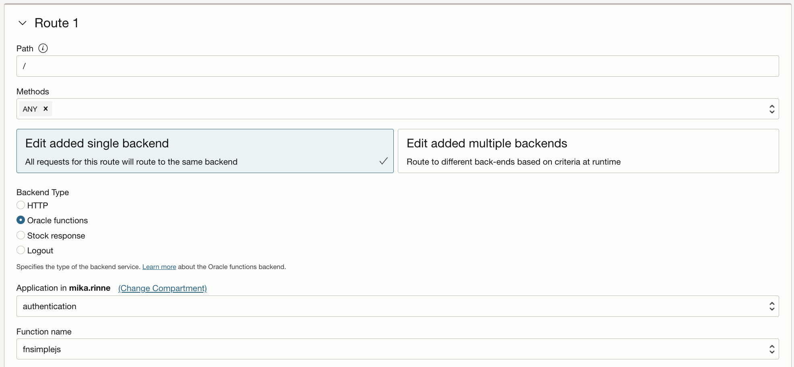

## Build and deploy the functions

### fnauthjs
<code>
const fdk=require('@fnproject/fdk');

fdk.handle(function(input){
  let json = "";

  if(input.token) {
      json = {
        "active": true,
        "principal": "myprincipal",
        "scope": ["fnsimplejs"],
        "clientId": "clientIdFromHeader",
        "expiresAt": "2023-12-31T00:00:00+00:00",
        "context": {
            "username": input.token
        }
      }
  } else {
      json = {
        "active": false,
        "expiresAt": "2023-12-31T00:00:00+00:00",
        "wwwAuthenticate": "Bearer realm=\"www.com\""
      }
  }
  console.log("AUTH input token " + input.token);
  return json;
})
</code>

### fnauthjs
<code>
const fdk=require('@fnproject/fdk');

fdk.handle(function(input, ctx){
  return ctx.headers['Fn-Http-H-Username'];
})    
</code>

## Create the API Gateway based on the functions

 

    

